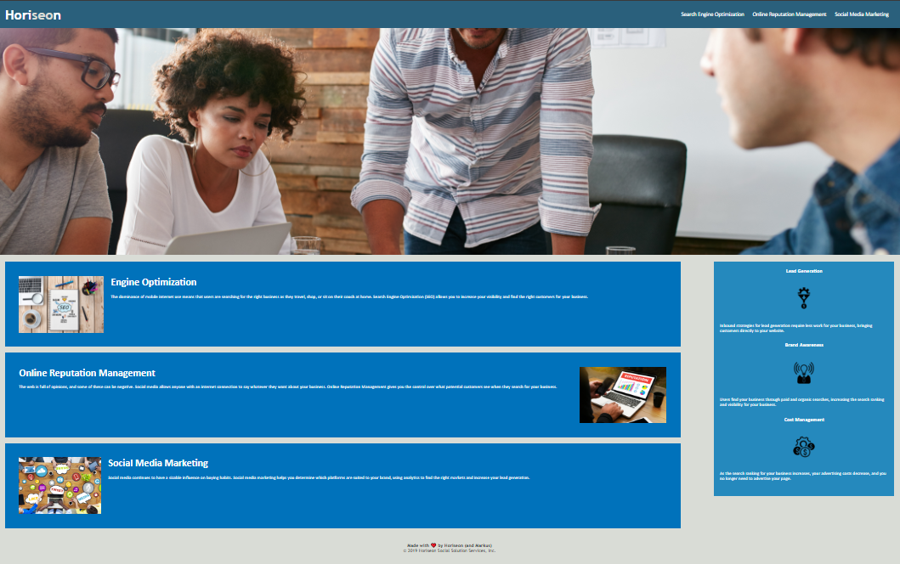

# UCI-Challenge-1-Oh-God

## Horiseon Website Challenge

https://markkoos.github.io/Horiseon-Website-Challenge1/

```
Was tasked with optimizing the source code for a business optimization website
Add alt values to images so that search engines would be more inclined to show this website to people looking for their services
Improved organization of the code under the <body> header for ease of access
```

Horiseon is a search engine optimization service (SEO) that helps your business become easier to access and find in today's search engines. 

